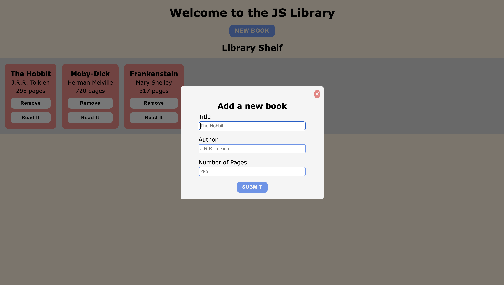
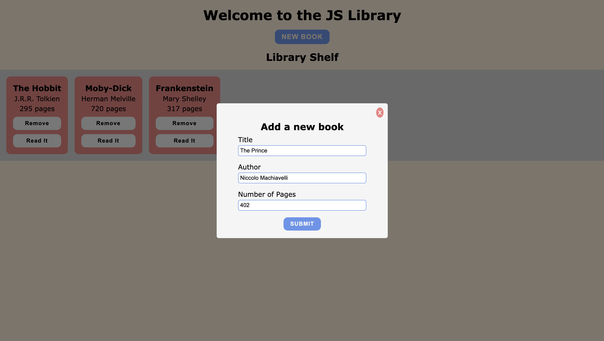
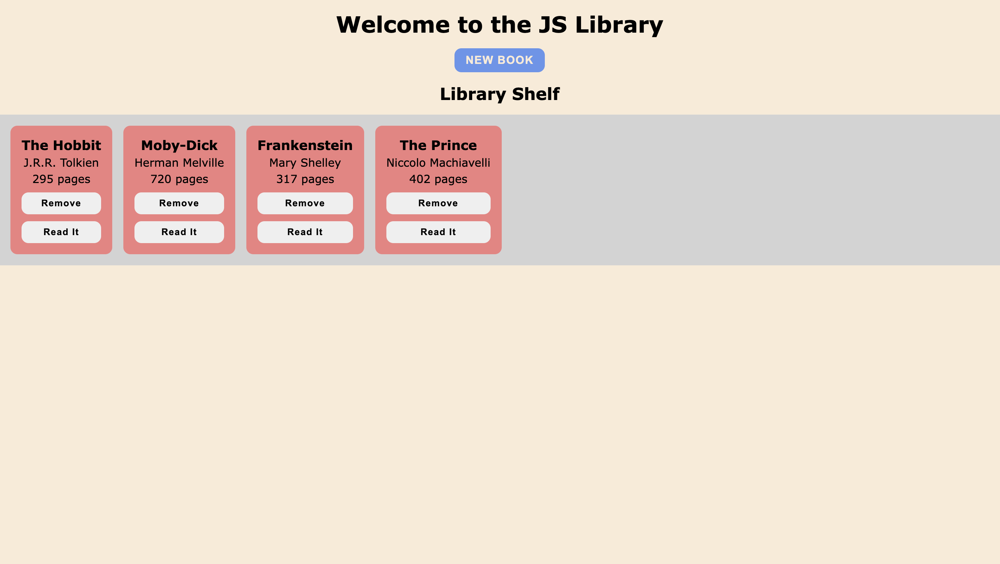
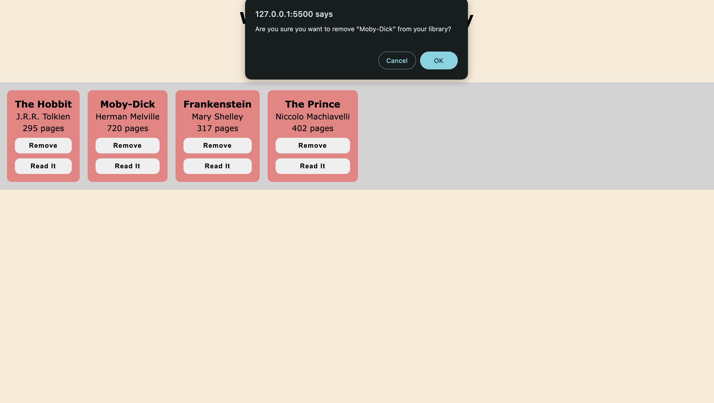
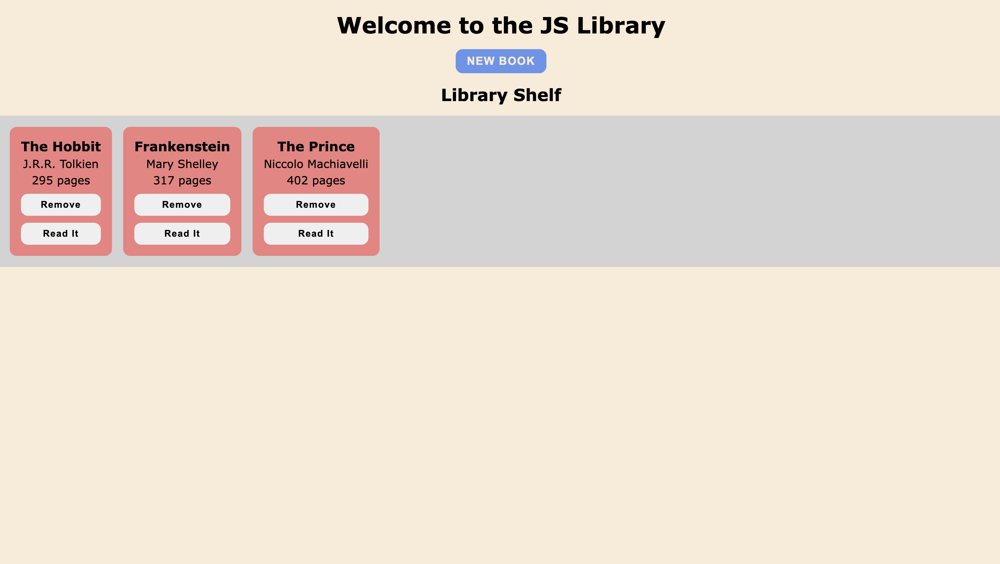

# Book Library with JS

Library project for the JavaScript course of TOP

Link to project: https://www.theodinproject.com/lessons/node-path-javascript-library

## Project Showcase

### Initial page

### Adding a new book

### Removing a book

